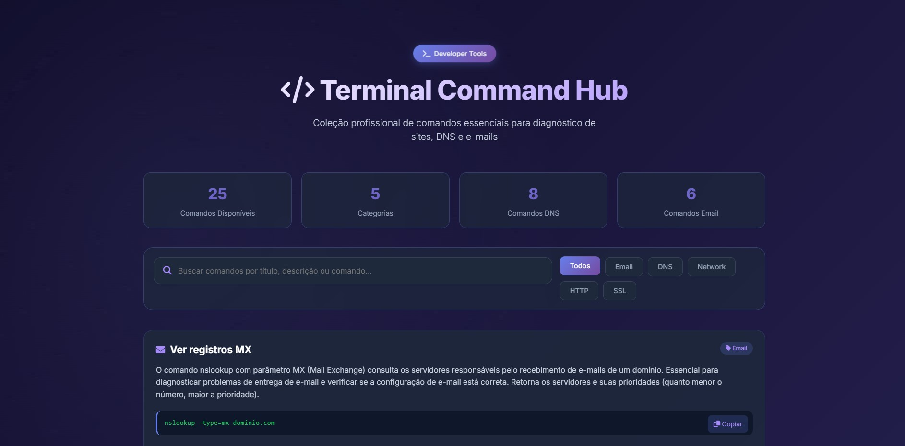

# 🖥️ Terminal Command Hub | DevTools Pro

gi

> **Coleção profissional de comandos essenciais para diagnóstico de sites, DNS e e-mails**

## 📋 Sobre o Projeto

O **Terminal Command Hub** é uma ferramenta web desenvolvida para profissionais de infraestrutura, desenvolvedores e administradores de sistemas. Oferece uma interface moderna e intuitiva para acessar rapidamente comandos essenciais de terminal utilizados em diagnósticos de rede, DNS, e-mails e troubleshooting de servidores.

### ✨ Funcionalidades

- 🔍 **Busca em tempo real** - Filtre comandos por título, descrição ou comando
- 🏷️ **Filtros por categoria** - Organização por áreas de atuação (Network, DNS, Email, etc.)
- 📊 **Estatísticas dinâmicas** - Visualize a quantidade total de comandos e por categoria
- 🎨 **Interface moderna** - Design responsivo com Bootstrap 5 e Font Awesome
- ⚡ **Performance otimizada** - Carregamento dinâmico dos comandos via JavaScript

## 🚀 Tecnologias Utilizadas

- **HTML5** - Estrutura semântica
- **CSS3** - Estilização personalizada
- **Bootstrap 5.3** - Framework CSS responsivo
- **Font Awesome 6.4** - Ícones vetoriais
- **Google Fonts (Inter)** - Tipografia moderna
- **JavaScript ES6** - Lógica e interatividade
